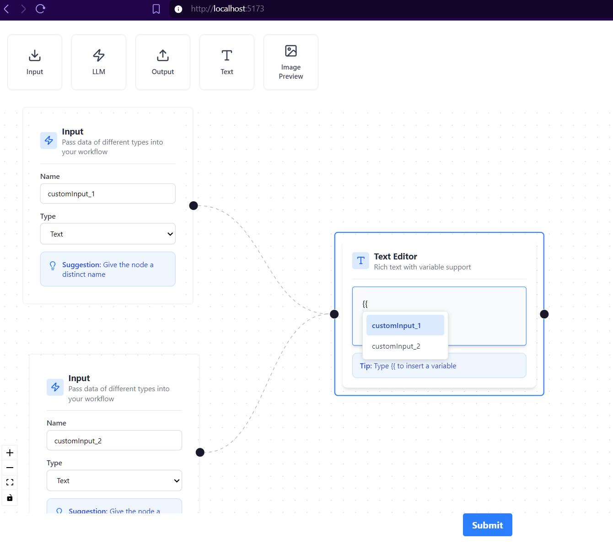

# Workflow Pipeline Builder

## Overview

A visual workflow pipeline builder application that allows users to create and design complex data processing workflows through an intuitive drag-and-drop interface. The application combines a modern React frontend with a Python FastAPI backend to provide a seamless experience for building, validating, and executing LLM-based workflows.

### Key Features

- **Drag-and-Drop Interface**: Easily add and connect workflow nodes
- **Multiple Node Types**: Input, Output, LLM, Text, and Image Preview nodes
- **Visual Pipeline Design**: See your workflow structure in real-time
- **Workflow Validation**: Backend validation ensures workflows form valid Directed Acyclic Graphs (DAGs)
- **Real-time Processing**: Submit workflows for execution and processing

## Walkthrough

Watch a brief walkthrough of the Workflow Pipeline Builder in action:

[View Full Video](https://www.loom.com/share/e8319324e4564718a920edbfe553ee77)

## Screenshots




## Setup Instructions

### Frontend Setup

```bash
cd frontend
npm install
npm run start
```

The frontend application will start on **http://localhost:5173/**

### Backend Setup

The backend requires Python 3.11 or higher.

```bash
cd backend
pip install -r requirements.txt
uvicorn main:app --reload
```

The backend API will be available at **http://localhost:8000/**

## Access the Application

Once both frontend and backend are running, open your browser and navigate to:

```
http://localhost:5173/
```

## Technology Stack

- **Frontend**: React 18, Vite, React Flow, Tailwind CSS
- **Backend**: Python 3.11, FastAPI, Pydantic
- **API Communication**: REST API with CORS support

## Project Structure

```
frontend_assessment_technical/
├── frontend/          # React Vite application
│   ├── src/
│   │   ├── App.jsx
│   │   ├── nodes/     # Node component definitions
│   │   ├── toolbar.jsx
│   │   ├── ui.jsx
│   │   └── store/     # State management
│   └── package.json
├── backend/           # FastAPI application
│   ├── main.py        # Main application server
│   └── requirements.txt
└── images/            # Documentation images
```
